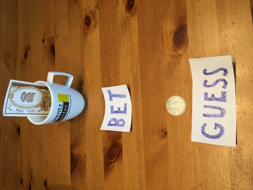

> Smart Contracts are not contracts and not smart. 
> -- Wolfgang Ahrendt 

## Introduction

On this page, we introduce the example case of casino implemented as
a Smart Contract on the blockchain. This example was prepared by
Wolfgang Ahrendt for discussion in September 2021, and also bases on
Gordon Pace.

The casino offers a simple bet game. The casino operator places
a (hidden) secret (HEAD or TAIL) inside the contract. Then, a player
can challenge the casino by placing a bet, and guessing the secret. If
players win, their bet is doubled, otherwise the deposit is taken.
A play of the game is given in the next section. 

From a service-oriented point of view, the casino is a component which
offers several services (or methods) for altering the state, and only
certain roles are allowed to trigger them.

## A Play in the Casino

Let us consider a play of our casino game. We assume, that the casino
exists. But it has no money in its account. 


Firstly, the operator places money in the pot from his own money. They
call the designated service `addToPot`. 


Secondly, a new round needs to be initialised (`createGame`). The
operator chooses a number, where the number's least-significant bit
determines whether the operator selected HEAD or TAIL. The hash of the
number is stored inside the contract. This is a simple bit commitment
protocol: The operator is not able to change their choice, and the
player can not guess the operator's choice as it is obfuscated by the
other bits in the number.

 

The game is ready for a player, which is first one, who places a bet
and guess (`placeBet`). The bet is transformed from the player's
wallet. The guess is boolean value: HEAD or TAIL.




The game of the looks as follows, and is ready to be decided.


If the players win, they become their bet doubled. If the oprator
wins, the player's money stays in the pot. In both cases, the casino
is ready for a new play.


<!-- [](B0.jpg) -->

## State Space

There is one operator over the casino's lifecycle , and one at most
one player at the time in the casino. State space of the game consists
of:

- the `pot` (an integer value),
- the player's `bet` (an integer value),
- player's `guess` (head or tail),
- a hashed `secret` (an integer value), given by the casino operator, and
- the current player and the operator identified by their unique addresses.


## Solidity Contract

First: 

> This contracts contains security issues. Please do not use this
> Smart Contract as the basis for your new disruptive business model.


```solidity
/* This smart contract uses simplified Solidity syntax
   and does not compile as is. The original contract was
   written by Gordon Pace, and contained also a timeout
   as a counter measure against the operator not calling
   decideBet. The current simplified version was written
   by Wolfgang Ahrendt. It deliberately introduces
   security bugs. */

contract Casino {

  address public operator;
  
  uint public pot;
  
  // The hashed number submitted by the operator
  bytes32 public hashedNumber;
  
  address public player;
  
  enum Coin { HEADS, TAILS }
  Coin guess;

  uint bet;

  // The state of the contract
  enum State { IDLE, GAME_AVAILABLE, BET_PLACED }
  State private state;
  
  // Create a new casino
  constructor() public {
    operator = msg.sender;
    state = IDLE;
    pot = 0;
    bet = 0;
  }
  
  // Add money to pot
  function addToPot() public payable {
    require (msg.sender == operator);
    pot = pot + msg.value;
  }
  
  // Remove money from pot
  function removeFromPot(uint amount) public {
    // no active bet ongoing:
    require (state != BET_PLACED);
    require (msg.sender == operator);
    operator.transfer(amount);
    pot = pot - amount;
  }
  
  // Operator opens a bet
  function createGame(bytes32 _hashedNumber) public {
    require (state == IDLE);
    require (msg.sender == operator);
    hashedNumber = _hashedNumber;
    state = GAME_AVAILABLE;
  }

  //caller syntax: contractaddress.placeBet(HEADS).value(1000 Wei)
  
  // Player places a bet
  function placeBet(Coin _guess) public payable {
    require (state == GAME_AVAILABLE);
    require (msg.sender != operator);
    require (msg.value <= pot);
    
    state = BET_PLACED;
    player = msg.sender;

    bet = msg.value;
    guess = _guess;
  }
  
  // Operator resolves a bet
  function decideBet(uint secretNumber) public {
    require (state == BET_PLACED);
    require (msg.sender == operator);
    require (hashedNumber == cryptohash(secretNumber));
    
    Coin secret = (secretNumber % 2 == 0)? HEADS : TAILS;
    
    if (secret == guess) {
      // player wins, gets back twice her bet
      pot = pot - bet;
      player.transfer(2*bet);
      bet = 0;
    } else {
      // operator wins, bet transfered to pot
      pot = pot + bet;
      bet = 0;
    }
    
    state = IDLE;
  }
}

```

## Explanation of the contract 

Initially both, `pot` and `bet`, are empty. The hashed `secret` and
the `guess` have a default value value. The program allows the
following operations:

- `constructor` Initialises the state of the contract, e.g., sets 
  the `operator` to the account which added the contract to the
  blockchain.
  
- `createGame(_hashedNumber)`: Initialises a new play of the game,
   e.g., sets the given hashed value of the `secret` internally.

- `addToPot()`. Transfers money from the operator to the pot.
    This is implemented by a *payable* method. The *payable* modifier
    gives a method an implicit argument which holds the amount of
    money which was sent along with the method invocation. Here, it
    indicates that the method caller sends the amount of money which
    goes into the `pot` from his blockchain wallet. The operation can
    only be executed by the operator. If this condition fails, the
    state will roll back to the point where the external call to the
    blockchain was made. In Solidity, the roll back conditions are
    expressed as require instructions.

- `removeFromPot()`. Transfers money from the pot to the `operator`. 
   This can only be done if no bet is placed.

- `placeBet(guess)`. Let the sender place a bet. If the game is available, 
   the caller of this method becomes the player, its sent money is
   added to the pot, the given `guess` is stored.

- `decideBet(secretNumber)`. Decides the winner of a play. It can only
  be called if the bet is placed. If the player wins, the amount of
  the bet will be doubled, and send to the player. If the operator
  wins, the bet is moved into the pot.

Note, Solidity has an internal transaction system. An external service
calls starts a new transaction. If the execution fails, e.g.,
a `require` is not met, the transaction is rolled backed, and the
state remains the same in the block chain.

## Submitted Material

* [Original Solidity file](SimpleCasino.sol) contributed by Wolfgang Ahrendt

* [Verified Solidity](Casino.sol), [Logfile of SLCVerify](slcverify-out.txt)
contributed by Jonas Schiffl  

* <a name="timed">Timed Automata (Uppaal) contributed by Jonas Becker and Paula Herber</a>

     Automata describing the smart contract calls:
    
    
    
    Automata describing the smart contract operations:
    


    > The "direct" versions are closely based on the source code, the
    > "state" versions on the state chart. The versions without
    > overflow protection model the system with all its flaws, while
    > the versions with overflow protection at least prevent integer
    > overflows and underflows, because Uppaal does not allow to check
    > other properties while those are still possible.
    
  * [uppaal/DirectCasinoOverflowProtection.xml](uppaal/DirectCasinoOverflowProtection.xml)
  * [uppaal/DirectCasino.xml](uppaal/DirectCasino.xml)
  * [uppaal/StateCasinoOverflowProtection.xml](uppaal/StateCasinoOverflowProtection.xml)
  * [uppaal/StateCasino.xml](uppaal/StateCasino.xml)

  * [uppaal/CasinoReentrant.xml](uppaal/StateCasino.xml)

  > We extended our Uppaal modelto take into account the possibility
  > of reentrant behavior. Using this model, Uppaal can show that
  > integer over-/underflows are still possible, even with usual
  > countermeasures (requires in appropriate methods) in place. For
  > example, a player can cause an integer underflow for the pot
  > variable by claiming a timeout if the operator does not decide
  > the bet, and then claiming the timeout again when the casino
  > tries to transfer his winnings to him.
  >
  > We also created a variant of our model (see attachment) that
  > contains an easy countermeasure against any reentrant behaviour:
  > Whenever a method on the casino is called, a boolean busy is set
  > to true. All methods require that busy is false, so any
  > reentrant method call would cause a rollback. Uppaal can verify
  > that this countermeasure indeed prevents any reentrant
  > behaviour, and that over- or underflows are no longer possible.


* [VerCors Examples with explanation](vercors/)

* [Temporal Logic of Actions (TLA)](https://lamport.azurewebsites.net/tla/book.html) contributed by Alexander Weigl
  * [Casino.tla](Casino.tla)
  
* Translation to C contributed by Alexander Weigl for the use in 
  C-based verification tools (e.g., CBMC, SEAHORN)
  * [Casino.c](Casino.c)
  
* Automata describing the protocol contributed by Mattias Ulbrich

  
  {.bg-white style="background:#ccc"}
