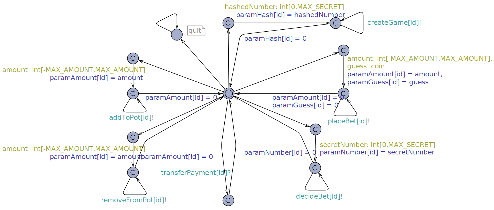

**Currently under construction ...**

* [Original Solidity file](../SimpleCasino.sol) contributed by Wolfgang Ahrendt

* [Verified Solidity](Casino.sol), [Logfile of SLCVerify](slcverify-out.txt)
contributed by Jonas Schiffl  

* <a name="timed">Timed Automata (Uppaal) contributed by Jonas Becker and Paula Herber</a>
 
 
     Automata describing the smart contract calls:
    
    
    
    Automata describing the smart contract operations:
    

    > The "direct" versions are closely based on the source code, the
    >     "state" versions on the state chart. The versions without
    >     overflow protection model the system with all its flaws,
    >     while the versions with overflow protection at least prevent
    >     integer overflows and underflows, because Uppaal does not
    >     allow to check other properties while those are still
    >     possible.
    
  * [uppaal/DirectCasinoOverflowProtection.xml](uppaal/DirectCasinoOverflowProtection.xml)
  * [uppaal/DirectCasino.xml](uppaal/DirectCasino.xml)
  * [uppaal/StateCasinoOverflowProtection.xml](uppaal/StateCasinoOverflowProtection.xml)
  * [uppaal/StateCasino.xml](uppaal/StateCasino.xml)

  * [uppaal/CasinoReentrant.xml](uppaal/StateCasino.xml)

    > We extended our Uppaal modelto take into account the possibility
    > of reentrant behavior. Using this model, Uppaal can show that
    > integer over-/underflows are still possible, even with usual
    > countermeasures (requires in appropriate methods) in place. For
    > example, a player can cause an integer underflow for the pot
    > variable by claiming a timeout if the operator does not decide
    > the bet, and then claiming the timeout again when the casino
    > tries to transfer his winnings to him.
    >
    > We also created a variant of our model (see attachment) that
    > contains an easy countermeasure against any reentrant behaviour:
    > Whenever a method on the casino is called, a boolean busy is set
    > to true. All methods require that busy is false, so any
    > reentrant method call would cause a rollback. Uppaal can verify
    > that this countermeasure indeed prevents any reentrant
    > behaviour, and that over- or underflows are no longer possible.

* [Vercors Examples with explanation](vercors/)

* [Temporal Logic of Actions (TLA)](https://lamport.azurewebsites.net/tla/book.html) contributed by Alexander Weigl
  * [Casino.tla](Casino.tla)
  
* Translation to C contributed by Alexander Weigl for the use in 
  C-based verification tools (e.g., CBMC, SEAHORN)
  * [Casino.c](Casino.c)
  
* Automata describing the protocol contributed by Mattias Ulbrich
  
